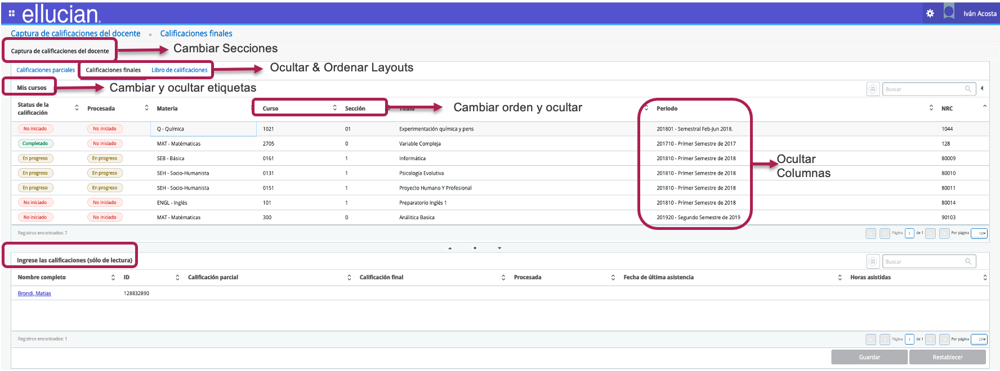
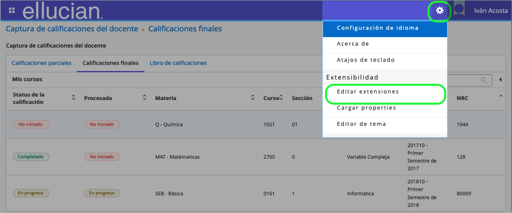
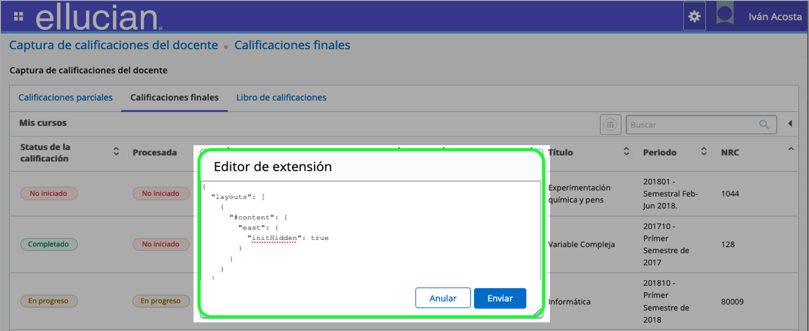
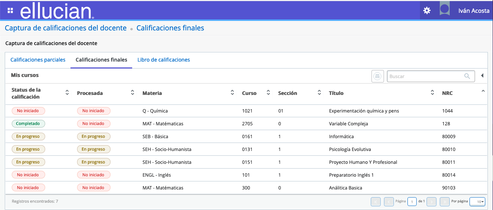

[![Contributors][contributors-shield]][contributors-url]
[![Forks][forks-shield]][forks-url]
[![Stargazers][stars-shield]][stars-url]
[![Issues][issues-shield]][issues-url]
[![Licencia][license-shield]][license-url]
[![LinkedIn][linkedin-shield]][linkedin-url]

   
<!-- PROJECT LOGO -->
<br />
<p align="center">
  <a href="https://www.ellucian.com/es">
     
  </a>
  <h1 align="center">Extensibilidad - Configuration Pages Components</h1>
</p>

## Contenido

* [Introducción](#Introducción)
  * [Características](#Alcance)
* [Ejemplo](#Ejemplo)
* [Licencia](#Licencia)
* [Contacto](#Contacto)
* [Agradecimientos](#Agradecimientos)

___
# Introducción
Muy rápidamente, recordemos el propósito de Extensibilidad para Banner 9. Esta es una caracteristica de la solución que nos permite *extender* la solución por medio de configuraciones y customizaciones evitando a toda costa modificación de código fuente (HardCode) al producto base, de esta manera se asegura reducir el impacto en los procesos de actualización de la solución, además de evitar la degradación de la solución a futuro.
 
 Una de estas utilidades que hacen parte de *Extensbilidad* es la herramienta de *Configuration Page Components*. Revisemos sus principales características

## **Características**

- Configuration Pages Compomnents (CPC), es una poderosa utilidad que permite ocultar, editar y cambiar el order de campos, secciones y layouts en la capa de presentación sin necesidad de modificar el código fuentes de la aplicación. Los principales cambios se puede  se puede aplicar a los principales campos, miremos:

<p align="center">
    
</p>

- Configuration Pages Compomnents (CPC), es una herramienta que está diseñada para ser utilizada por un rol técnico (desarrollador) ya que necesita tener conocimientos medios o profundos de HTML y el formato JSON. 

- Los cambios realizados con la herramienta (CPC) para páginas de SelfService de Banner, se almacenan en archivos JSON específicos para cada página en una ubicación predefinida y con un nombre predefinido. Todo esto se habilita por medio de la configuración de la solución.

- Se puede copiar los archivos JSON entre los diferentes ambiente de Banner, además no es necesario compilar, ni hacer deployment de nuevo para las aplicaciones, ya que solamente al habilitar el codigo en formato JSON dentro del editor, solamente hacemos un refresh (F5) a la página dentro del navegador.

- Importante que la edición de los campos solamente sea a campos o secciones no obligatorios.

- Finalmente, una de las buenas practicas, se recomienda que los cambios se hagan primero en un entorno de prueba (TEST) y se prueben a fondo antes de mover el archivo JSON a un entorno real (PROD). 
___
# Ejemplo
Lo primero que debemos hacer es habilitar la opción de *extensibilidad* para las aplicaciones del SelfServices que vamos a modificar. Mriremos aquí un ScreenShot 

<p align="center">
    
</p>

Una vez realizado el paso anterior, podemos hacer uso del editor para agregar el segmento de código en formato JSON. De esta manera podemos manipular los elementos gráficos en pnatalla 

<p align="center">
    
</p>

Allí podemos agregar el siguiente bloque de código. Con esto se esta ocultando la columna de Período Académico

```json
[{
	"sections": [
		{
			"name": "finalCourseDetailGrid",
				"fields": [
					{ "name": "term", "exclude": true }
				]
		}
	]
}]
```
Se guardan los cambios, y finalmente se actualiza (refresh - con F5) en el navegador para visualizar los cambios. Es así de simple hacer cambios en la capa de presentación de aplicaciones del SelfService para Banner.

<p align="center">
    
</p>

Finalmente, aquí puedes acceder a algunos ejemplos para las aplicaciones de:

Lista de Clase: [ClassList](https://github.com/iacosta/ellucian-pages-components/tree/master/ClassList)
Ingreso de Notas: [FacultGE](https://github.com/iacosta/ellucian-pages-components/tree/master/FacultyGE)

___
# Licencia
Distribuido bajo licencia BSD 2-Clause. Ver `LICENSE` para más información.
___
# Contacto
Iván Acosta - [@iacostac](https://twitter.com/iacostac) - ivan@acostacontreras.com

Link del Proyecto: [https://github.com/iacosta/ellucian-pages-components](https://github.com/iacosta/ellucian-pages-components)
___
# Agradecimientos
A mi buen amigo y excelente consultor Miguel de la O [LinkedIn Profile](https://www.linkedin.com/in/miguel-delao-64065125/) por sus iniciativas y buenos retos.!


<!-- MARKDOWN LINKS & IMAGES -->
<!-- https://www.markdownguide.org/basic-syntax/#reference-style-links -->
[contributors-shield]: https://img.shields.io/github/contributors/iacosta/ellucian-pages-components.svg?style=flat-square
[contributors-url]: hhttps://github.com/iacosta/ellucian-pages-components/graphs/contributors
[forks-shield]: https://img.shields.io/github/forks/iacosta/ellucian-pages-components.svg?style=flat-square
[forks-url]: https://github.com/iacosta/ellucian-pages-components/network/members
[stars-shield]: https://img.shields.io/github/stars/iacosta/ellucian-pages-components.svg?style=flat-square
[stars-url]: https://github.com/iacosta/ellucian-pages-components/stargazers
[issues-shield]: https://img.shields.io/github/issues/iacosta/ellucian-pages-components.svg?style=flat-square
[issues-url]: https://github.com/iacosta/ellucian-pages-components/issues
[license-shield]: https://img.shields.io/github/license/iacosta/ellucian-pages-components
[license-url]: https://github.com/iacosta/ellucian-pages-components/blob/master/LICENSE.txt
[linkedin-shield]: https://img.shields.io/badge/-LinkedIn-black.svg?style=flat-square&logo=linkedin&colorB=555
[linkedin-url]: https://www.linkedin.com/in/iacostac/
